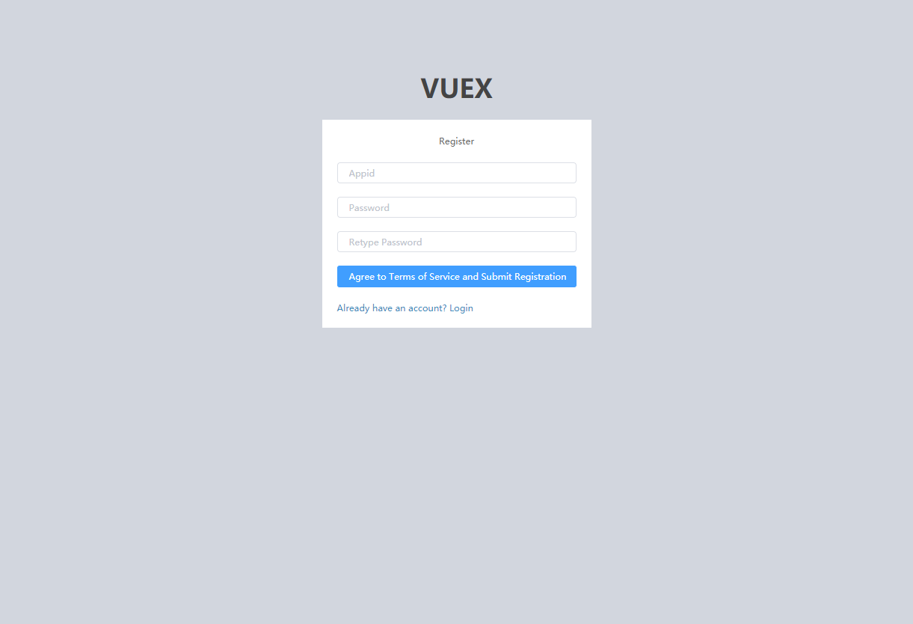
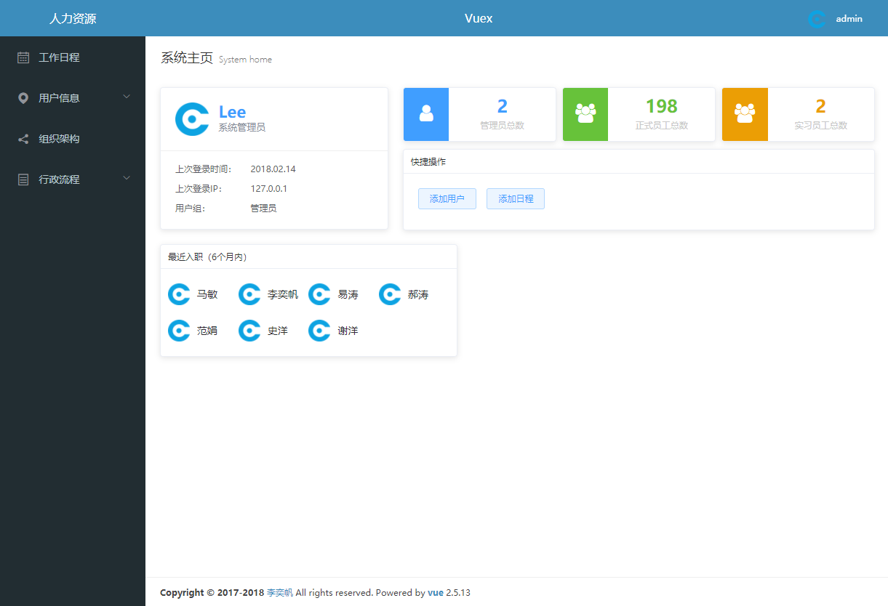
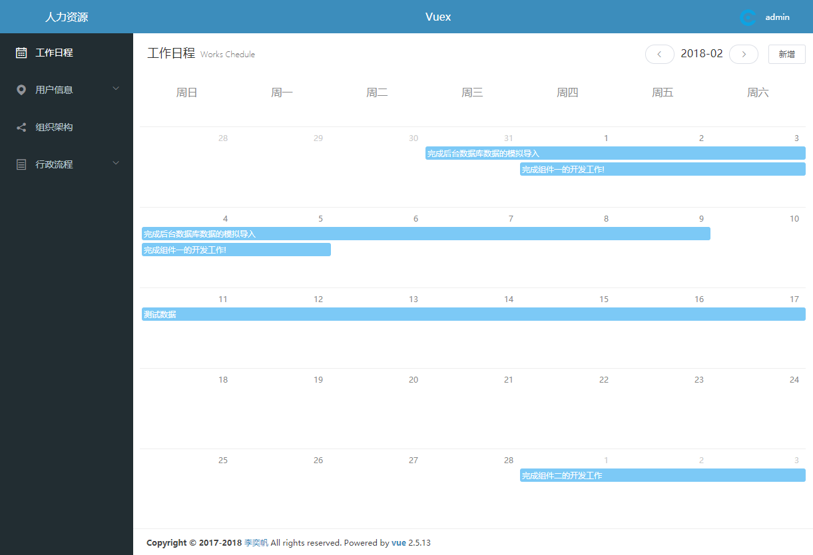
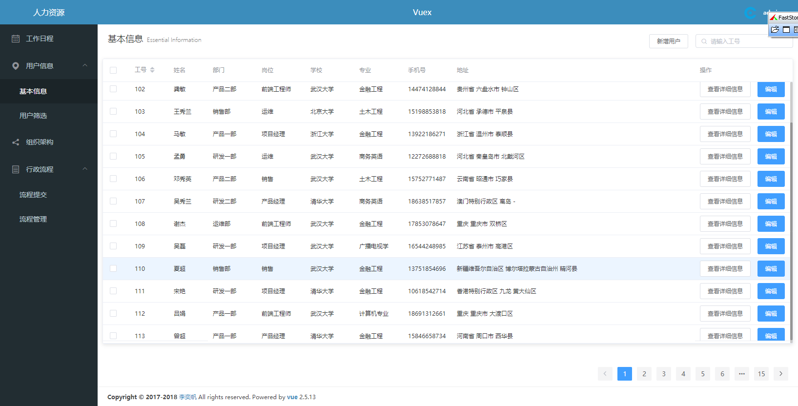
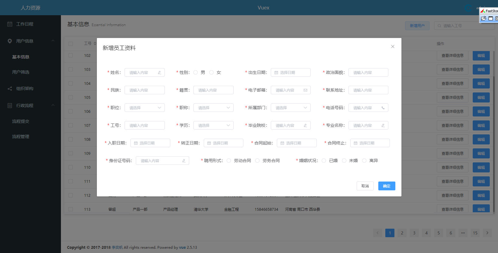
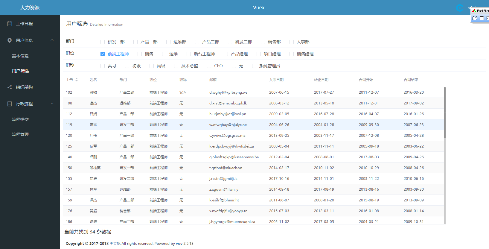
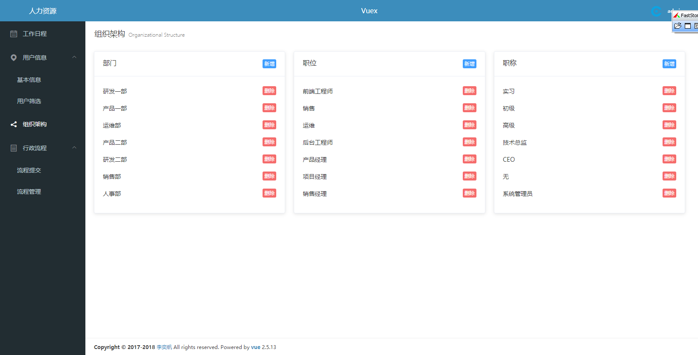
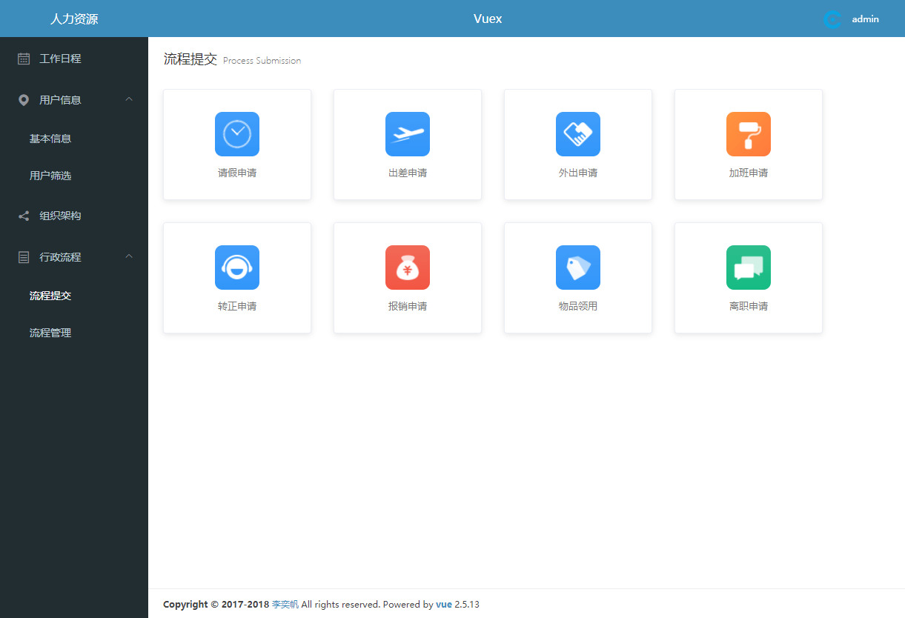
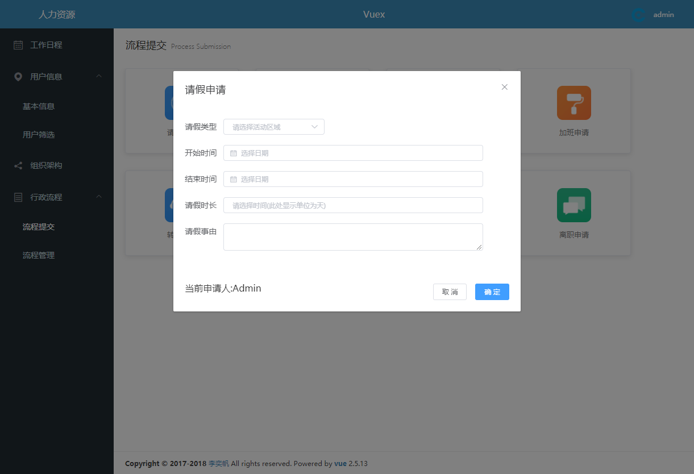

## vue-web-demo
独立开发的一个后台应用demo，前后端分离开发

## 主要功能
> 登录（登录验证及路由跳转拦截 基于node的token身份验证）、注册、列表分页、过滤筛选、仿worktile的工作日程，表单提交，详细信息的数据展示及数据可视化，实现数据的增删改查过滤及持久化；项目的前端页面和后台数据库数据交互和处理，过滤组件的开发，配合ElementUI界面美化；以及项目中所有后台接口的开发；


## 技术栈
> [vue.js](https://cn.vuejs.org/) 构建用户界面的 MVVM 框架，核心思想是：数据驱动、组件系统。

> [vue-cli](https://www.npmjs.com/package/vue-cli) 是vue的脚手架工具，目录结构、本地调试、代码部署、热加载、单元测试。

> [vue-router](https://router.vuejs.org/zh-cn/) 是官方提供的路由器，使用vue.js构建单页面应用程序变得轻而易举。

> [vuex](https://vuex.vuejs.org/zh-cn/) 是一个专为 vue.js 应用程序开发的状态管理模式，简单来说Vuex就是管理数据的。

> [Element](http://element-cn.eleme.io/#/zh-CN) 一套为开发者、设计师和产品经理准备的基于 Vue 2.0 的桌面端组件库

> [Vue-progressbar](http://hilongjw.github.io/vue-progressbar/) 进度条组件。

> [Node](https://nodejs.org/zh-cn/) 服务端的JavaScript，一个基于 Chrome V8 引擎的 JavaScript 运行环境。

> [axios](https://www.npmjs.com/package/axios) 一个基于 promise 的 HTTP 库，可以用在浏览器和 node.js 中。

> [Mongoose](https://www.npmjs.com/package/mongoose) 数据库，配合node进行后端接口开发

> [其他]() 其他第三方库不一一列举

> A Vue.js project


## 效果展示

> 注册页面


> 首页


> 工作日程


> 用户信息


> 用户信息编辑


> 用户筛选页面


> 组织架构


> 行政流程


> 流程提交



## 部署教程

> 因为是前后端一起开发，需要先部署好后端环境后，再执行npm run dev才能跑起来

``` bash
# 安装好mongo数据库后，导入Service目录中的数据备份
可以使用NoSQLBooster

# 在Service目录中安装后端需要的依赖
cnpm install

# 在Service目录中把后台跑起来
node ./app.js
```


## Build Setup

``` bash
# install dependencies
npm install

# serve with hot reload at localhost:8080
npm run dev

# build for production with minification
npm run build

# build for production and view the bundle analyzer report
npm run build --report

# run unit tests
npm run unit

# run all tests
npm test
```

## 项目组织架构
>├─ .eslintrc.js  
>├─ index.html  
>├─ package.json // 配置文件  
>├─ README.md // 说明文件  
>├─ build // webpack打包执行文件  
>├─ config // webpack打包配置文件  
>├─ code-standards //编码规范  
>├─ Service //后端的Api  
>├─ static // 存放私有系统的公共样式、脚本、图片  
>│　　│　　├─ css  
>│　　│　　│　　└─ reset.css // 初始样式  
>│　　│　　├─ fonts //字体  
>│　　│　　├─ img // 图片  
>│　　│　　├─ js  
>│　　│　　│　　└─ jquery.js // jQ库  
>├─ src  
>│　　├─ main.js // webpack入口/项目启动入口  
>│　　├─ http.js // axios的拦截器  
>│　　├─ config  
>│　　│　　├─ index.js // 共有配置文件  
>│　　├─ router  
>│　　│　　├─ index.js // 存放路由  
>│　　├─ views // 视图  
>│　　│　　├─ views.md  
>│　　├─ vuex // 存放于拆分出来的store.js  
>│　　│　　├─ store.js  
>│　　│　　├─ actions  
>│　　│　　├─ getters  
>│　　│　　└─ modules  
